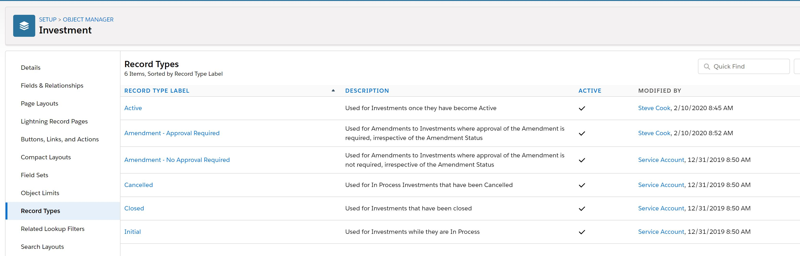

**PRE-DEPLOYMENT STEPS** The following steps will need to be executed prior to deployment:

insert steps here and here

!!!!!!!!!!!!!!!!!!!First Step: Turn Email Deliverability Off (DO NOT REMOVE ON CLONE FOR NEW RELEASES)

In Setup under Email->Deliverability, set Access Level to "System email only".

POST-DEPLOYMENT STEPS

Classes to delete

- src/classes/DeliverableValidationHelperTest.cls

- src/classes/DeliverableValidationHelperTest.cls-meta.xml

- src/classes/InvestmentClosureTest.cls

- src/classes/InvestmentClosureTest.cls-meta.xml

- src/classes/Payment_TriggerHandlerTest.cls

- src/classes/Payment_TriggerHandlerTest.cls-meta.xml

- src/classes/PaymentValidationHelperTest.cls

- src/classes/PaymentValidationHelperTest.cls-meta.xml

Field Updates to delete

SwitchToDefault field update on Investment Activity

Picklist to Change IME-25832

Go to Object Manager → Payment object → Subtype picklist values.

Make the “GPP Payment” as Inactive.  Go to the “Grant” Record Type in the Payment object and go to subtype picklist and remove GPP Payment from it.

Run the script (Workbench)

as referenced in the PR for:

Page Layout Assignments for DOA

Per Set all profiles to these 4 page layouts for these 4 record types:

Page Layout Assignments for Investment Activity

Per Set all profiles to this 1 page layout for this 1 record type:

Run the script in Developer Console

run the script in developer console from github

Open the debug logs and find size of approvalListToUpdate, if size of approvalListToUpdate > 0, run the same script again till size of approvalListToUpdate =0

DELETE the following configurable Action ( ):Label: ‘Add’, Configurable Action Name: ‘add’

!!!!!!!!!!!!!!!!!!!Last Step: IF NOT a full copy sandbox then Turn Email Deliverability On (DO NOT REMOVE ON CLONE, ALWAYS LEAVE THIS AS THE LAST STEP) (LEAVE Email Deliverability OFF for ALL FullCopy Sandboxes. e.g. FullCopy,FullCopy2)

In Setup under Email->Deliverability, set Access Level to "All email"

